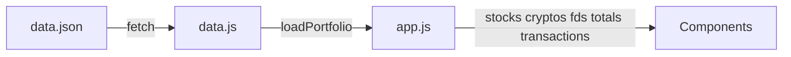

# PIP — Personal Investment Portfolio

Single-page web application for a Sri Lankan investor to track wealth across Colombo Stock Exchange (CDS), Crypto, and Fixed Deposits (FD).

---

## Project Context

- **Purpose:** Track and visualize investments across three asset classes: CDS stocks (GICS sectors), crypto (SOL, XRP), and fixed deposits.
- **Scope:** Personal use only; not production-facing. Data is stored locally in `data.json` (gitignored).
- **Stack:** Zero-build SPA — HTML, vanilla CSS, React 18 via CDN, Babel (JSX), Chart.js. Run via VS Code Live Server or any static HTTP server because `fetch('data.json')` requires HTTP (no `file://`).

---

## Features

- **Dashboard:** Total Net Worth, Unrealized P/L, Best/Worst performers, asset allocation charts, sector allocation, performance table.
- **CDS Account:** Stocks grouped by GICS sector, sector chips, CSE transaction cost banner, clickable symbol (navigates to Symbol Profile), totals strip. When `transactions` exist for a symbol, CDS values are derived from transactions (single source of truth).
- **Symbol Profile:** Per-symbol page with company header (logo, name, symbol, sector, current price in LKR), transaction history table (Buy/Sell with CSE-computed commission), and derived metrics: Total Shares Held, Current Market Value, Avg Holding Price, True Cost, Est. Sell Cost, Net Proceeds, Realized Profit, Unrealized P/L.
- **Crypto:** Cards with USD/LKR valuation, allocation, USD→LKR rate banner.
- **Fixed Deposits:** Cards with principal, interest rate, maturity, interest earned, progress.

---

## Project Structure

```
PIP-Web-App/
├── index.html              # Entry point; loads CDNs, data.js, components, app.js
├── app.js                  # Root React app: loadPortfolio(), routing, LoadingScreen, ErrorScreen
├── data.js                 # Calculation engine: computeStock, computeCrypto, computeFD, getPortfolioTotals, loadPortfolio()
├── data.json               # Raw portfolio data (gitignored) — user edits this to update holdings
├── styles.css              # Dark finance theme; CSS variables for colors/spacing
├── components/
│   ├── Navbar.js           # Top nav: tabs (Dashboard, CDS, Crypto, FD), date, net worth
│   ├── Dashboard.js        # KPIGrid, AssetAllocationChart, SectorAllocationChart, PerformanceTable
│   ├── CDSAccount.js       # CDS stocks by GICS sector, transaction cost banner, totals strip
│   ├── CryptoSavings.js    # Crypto cards (SOL, XRP), allocation, USD→LKR rate banner
│   ├── FixedDeposits.js    # FD cards with maturity, interest earned, progress
│   ├── SymbolHeader.js     # Symbol profile header (logo, details, price)
│   ├── TransactionTable.js # Symbol profile transaction history
│   └── SymbolProfile.js    # Symbol profile container
├── Assets/
│   ├── company-logo/       # Stock/bank logos (PNG/SVG)
│   └── cryptocurrency-logo/ # Crypto logos (optional)
└── .gitignore              # data.json, debug-*.log
```

---

## Data Flow



- **data.json** (source of truth): `usdToLkr`, `stocks[]`, `crypto[]`, `fixedDeposits[]`, optional `transactions{}`. User edits prices/quantities and transactions here.
- **data.js**: Fetches `data.json`, runs `computeStock`, `computeCrypto`, `computeFD`, `applyTransactionDerivedToStock` (when transactions exist), `getPortfolioTotals`, returns `{ stocks, cryptos, fds, totals, transactions }`.
- **app.js**: Calls `loadPortfolio()` on mount; passes computed data to page components. Handles routing: CDS Account passes `onSymbolClick`; Symbol Profile receives `symbol`, `stocks`, `transactions`, `onBack`. When `transactions[symbol]` exists, CDS stock values are derived from transactions (single source of truth).

---

## data.json Schema

Create `data.json` in the project root with the following structure:

| Field | Type | Description |
|-------|------|-------------|
| `usdToLkr` | number | USD to LKR exchange rate for crypto valuation |
| `stocks[]` | array | CDS holdings |
| `stocks[].symbol` | string | Stock symbol (e.g. `COMB`, `SAMP.N`) |
| `stocks[].company` | string | Company name |
| `stocks[].sector` | string | GICS sector (e.g. `Banking`, `Capital Goods`) |
| `stocks[].quantity` | number | Share quantity |
| `stocks[].avgBuyPrice` | number | Average buy price (LKR) |
| `stocks[].currentPrice` | number | Current market price (LKR) |
| `stocks[].logo` | string | Optional logo path (e.g. `Assets/company-logo/...`) |
| `crypto[]` | array | Crypto holdings |
| `crypto[].symbol` | string | Symbol (e.g. `SOL`, `XRP`) |
| `crypto[].name` | string | Display name |
| `crypto[].quantity` | number | Quantity held |
| `crypto[].avgBuyPrice` | number | Average buy price (USDT) |
| `crypto[].currentPrice` | number | Current price (USDT) |
| `crypto[].logo` | string | Optional logo path |
| `crypto[].color` | string | Optional hex color for charts |
| `fixedDeposits[]` | array | FD accounts |
| `fixedDeposits[].id` | string | Unique ID |
| `fixedDeposits[].bank` | string | Bank name |
| `fixedDeposits[].accountNumber` | string | Account number |
| `fixedDeposits[].principal` | number | Principal (LKR) |
| `fixedDeposits[].interestRate` | number | Annual interest rate (%) |
| `fixedDeposits[].startDate` | string | ISO date (e.g. `2024-06-01`) |
| `fixedDeposits[].maturityDate` | string | ISO date |
| `fixedDeposits[].logo` | string | Optional logo path |
| `fixedDeposits[].color` | string | Optional hex color |
| `transactions` | object | Optional. Keyed by symbol. |
| `transactions[symbol]` | array | Buy/Sell records for that symbol |
| `transactions[].tradeDate` | string | ISO date (e.g. `2026-02-15`) |
| `transactions[].shares` | number | Share quantity |
| `transactions[].avgPrice` | number | Price per share (LKR) |
| `transactions[].grossAmount` | number | shares × avgPrice |
| `transactions[].commission` | number | Optional; computed by app using CSE rules if omitted |
| `transactions[].netAmount` | number | Optional; computed by app if omitted |
| `transactions[].status` | string | `"BUY"` or `"SELL"` |

For symbols with `transactions`, CDS holdings (quantity, true cost, P/L) are derived from transactions; `stocks[].quantity` and `stocks[].avgBuyPrice` are overwritten. `data.json` is gitignored to keep personal financial data private.

---

## Key Calculations (data.js)

- **CDS (stocks without transactions):** Uses `quantity`, `avgBuyPrice` from `stocks[]`; applies CSE buy 1.12%, tiered sell commission (1.12% up to Rs.100M, 0.6125% above). Computes `trueCostBasis`, `estimatedSellCost`, `netSaleProceeds`, `unrealizedPL`, `breakEvenPrice`.
- **CDS (stocks with transactions):** Values derived from `transactions` via `computeSymbolDerived` and `applyTransactionDerivedToStock`; same CSE logic; `stocks[]` overwritten for quantity, cost, P/L.
- **Transactions:** `computeTransactionCommission`, `deriveNetAmount` — BUY: commission = gross × 1.12%; SELL: tiered; `netAmount` = gross ± commission. `computeTransactionWithCSE` applies CSE logic to each transaction.
- **Symbol Profile:** `computeSymbolDerived` — `totalShares`, `costBasis`, `rawCostBasis`, `buyCostPaid`, `avgHoldingPrice`, `realizedProfit`, `netSaleProceeds`, `unrealizedPL`.
- **Crypto:** Market value in USD/LKR, unrealized P/L, allocation %.
- **FD:** Maturity value, interest earned, accrued interest, days to maturity.

---

## Setup & Run

1. Clone the repo.
2. Create `data.json` in the project root (use the schema above).
3. Serve via **Live Server** (VS Code extension) or `npx serve .` — required for `fetch('data.json')`.
4. Open `index.html` (or `http://localhost:port/`).

---

## Dependencies (CDN)

- Chart.js 4.4.2
- React 18, ReactDOM 18
- Babel standalone (JSX)

---

## Theme & Styling

Dark finance theme in `styles.css` using CSS variables: `--bg-base`, `--accent`, `--gain`, `--loss`, `--text-primary`, `--text-secondary`, etc. `.page-wrapper` max-width 1600px; responsive breakpoints for mobile. Symbol Profile page (`.symbol-profile-page`) uses a light theme for the header and transaction section; the rest of the app remains dark.

---

## Asset Paths

- **Logos:** Relative paths, e.g. `Assets/company-logo/Commercial-Bank.png`, `Assets/cryptocurrency-logo/solana.png`. Logos use a white background wrapper for visibility on the dark theme.
- **KPI icons (optional):** `Assets/net-worth.png`, `Assets/unrealized-pl.png`, `Assets/best-performer.png`, `Assets/worst-performer.png`. Emoji fallbacks (💰 📈 🏆 📉) if files are missing.
